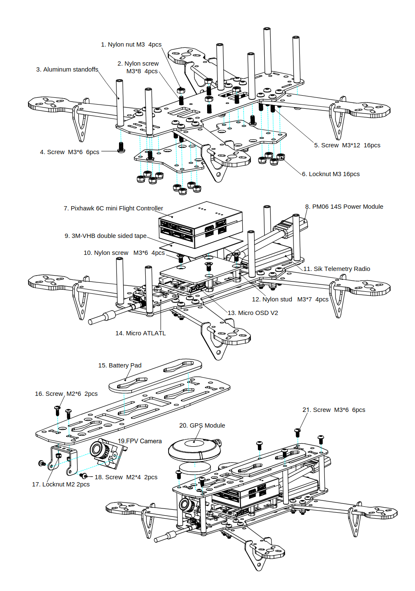
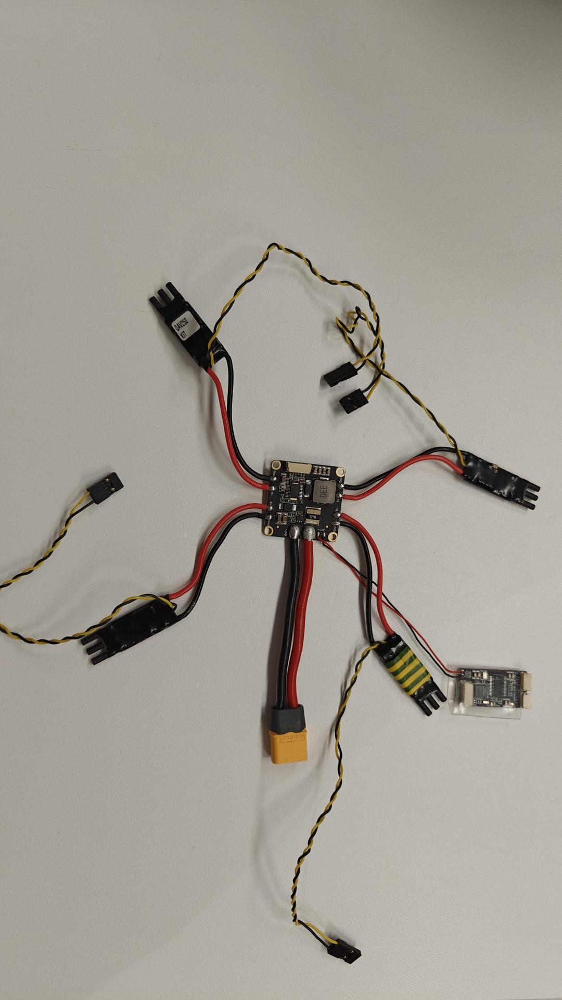
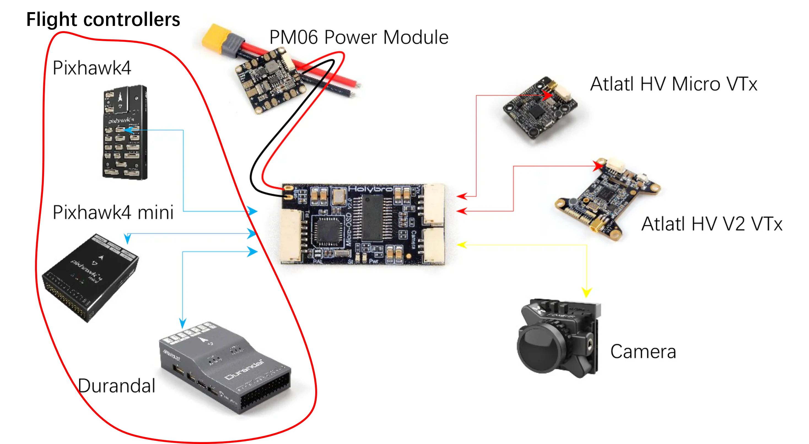
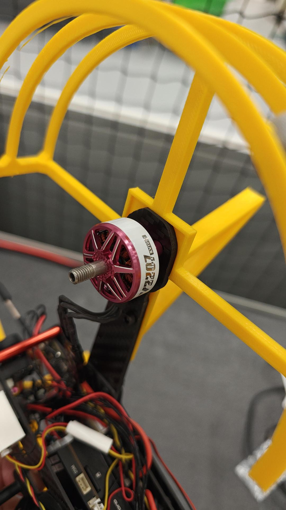
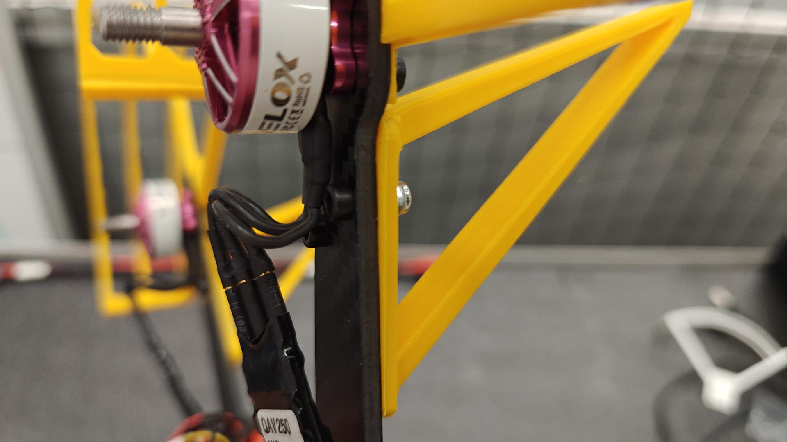
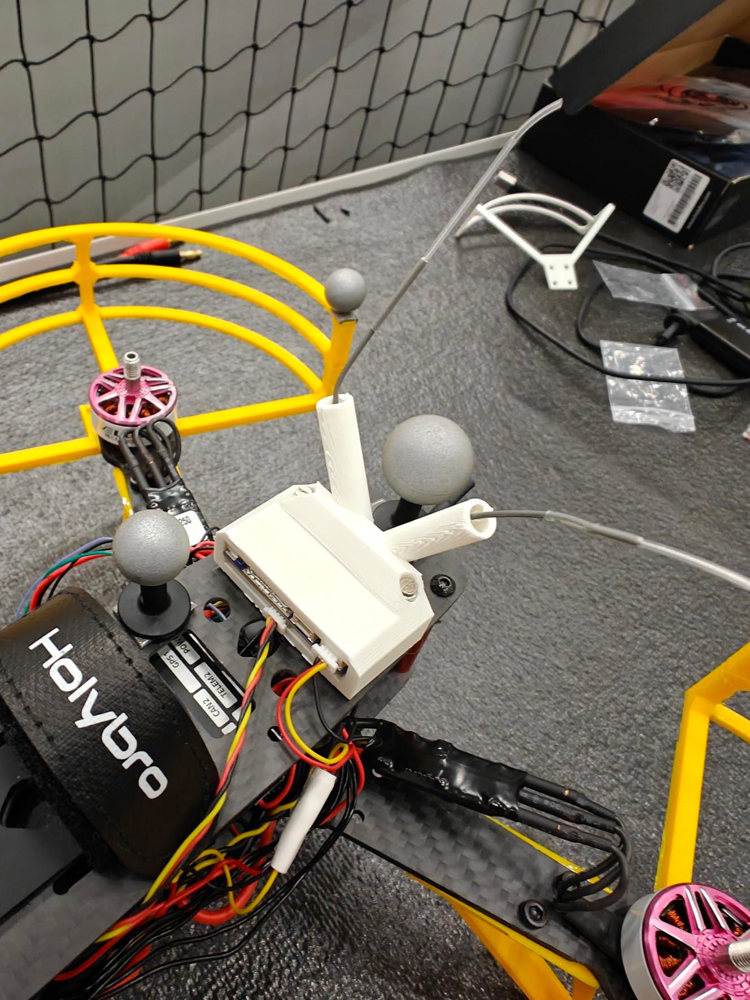
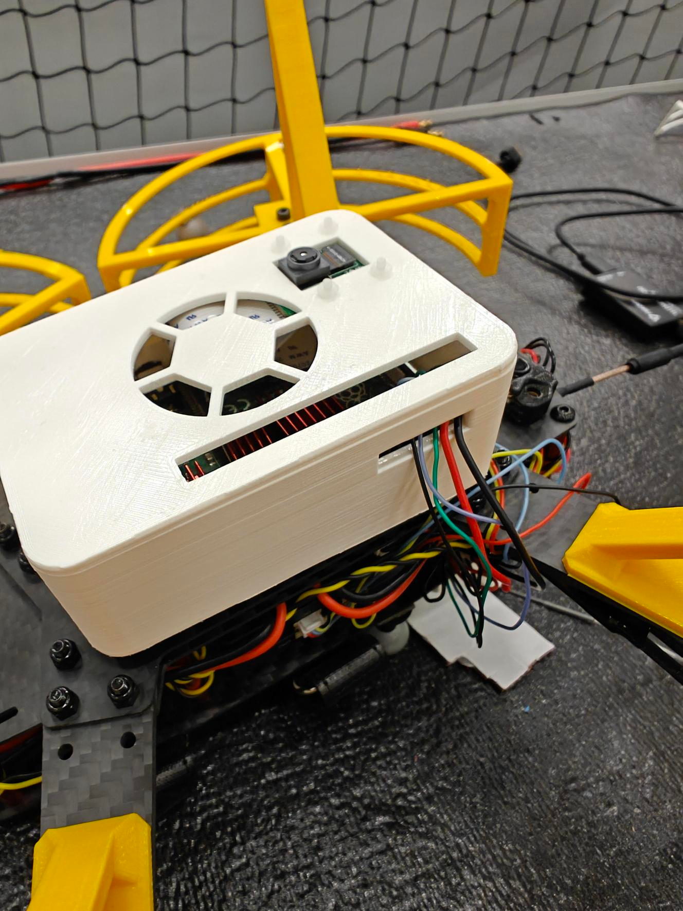
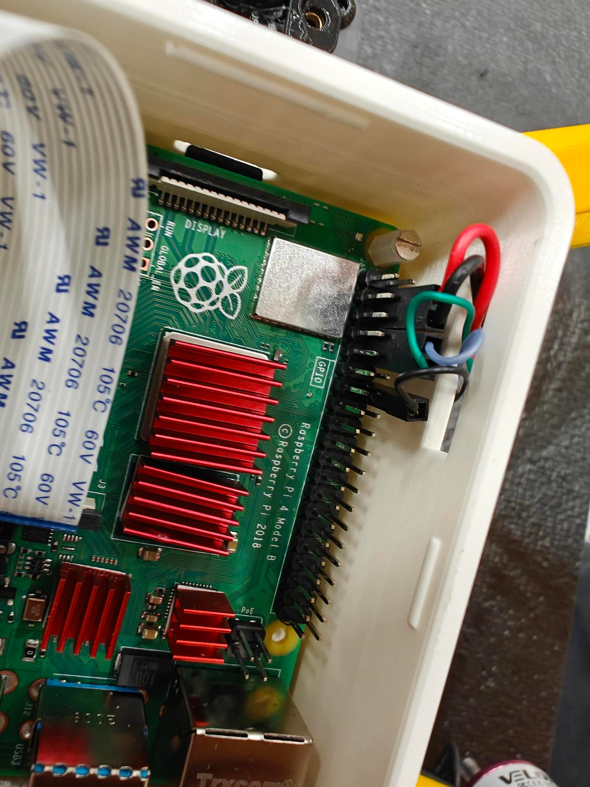

# QAV250 Build Guide (No Hints)

This page contains a no-hints set of links pointing out how to build a QAV250 drone kit to the one we have specced out here at UCL for our drone research 

[TOC]

## Building a QAV250

As mentioned in the drone basics chapter, broadly a drone's physical components can be split into four types 

1. Chassis
2. Flight Controller
3. Motors and Power Electronics 
4. Communications and Sensors

You will need to have a very careful think about the order that you build and construct the various parts, the wrong order might cause screws to be covered up, or connectors to be blocked up. 

Resources:

- [PX4 QAV250 Build Guide (OLD)](https://docs.px4.io/v1.14/en/frames_multicopter/holybro_qav250_pixhawk4_mini.html)

### Build Instruction Sheet

The Pdf link of the instruction sheet printed out on the table

> It is recommended that you don't put the top plate on until you are sure everything is up and ready to fly

### Power Distribution Board and ESCs 

One of the first components you will come across is the spidery looking bunch of cables attached to a central board

The main board is what is known as the power distribution board and is responsible for powering all the components on the drone, as well as handling the high current draws required by the motors! 

Each of the four legs contains what is known as the electronic speed controller (ESC). The ESC manages the speed (current draw) of the motor using an input signal from the flight controller. The input signal is often a specific PWM aka pulse width modulation signal. The cables here are rather thick to enable the high current that is required to power the motors. This is a key component in flight. The signal cables plug into the back of the FC in slots 1,2,3 and 4. 

> Note: Watch the orientation of the ESCs when you attach them, they are soldered in such a way that two of them are intentionally upside down when laid flat. 

> Note: You will need to double check the order of the ESC cables are plugged into the FC when you get to running the software configuration. Making a mistake here may cause the drone to be uncontrollable! Rea

The final component attached by the thin red and black wires are a video transmitter powering module. This is a second module used to transmit video data in analogue but low latency manner to a receiver. Here is a link to the device, work out how the video transmission is powered! 

> Note: that one of the connectors is shown to connect to the flight controller. We are replacing this connection with a connection from the FC to an onboard computer instead. 

### Motors

You will see that there are no instructions on installing the motors! 

Hopefully you have a good idea of where the motors are meant to go! Try and install them so that the wires go towards the chasis and dont poke out the side. 

We have printed some propellor guards for the drone, these go under the arm using the same mounting points as the motors. You will need the m3x8mm bolts. Ensure that they are securely fastened

We have also printed off some longer landing legs for the drone too to accomodate the companion computer underneath. Attach those with appropriate bolts and nylock nuts too.

> **DO NOT INSTALL THE PROPELLORS YET**

The motors should plug into the ESCs in a sraightforward manner with left cable going to left banana plug, center to center and right to right. 

Compare your setup with the example drone before you use a ziptie to fix down the ESC. 

### Pixhawk 6C Flight Controller

The QAV250 uses the Pixhawk 6C Flight controller. This is essentially a small computer (embedded microcontroller) which is designed to support the low level high frequency control of a UAV (e.g. stable flight), communications and basic sensor processing. 

The 6C has a number of ports on all sides of the drone - read a bit about it on the docs to work out what each one is for! 

This will have a lot of cables coming out of it, but you probably want to work out how to power it! 

> Note: Use the custom cable with the jumper cables coming out of them - this will be used for powering the companion computer later. 

### Connecting the SIK Radio

The second communication method (after the passive video feed communication method) is using the SIK Radios on 433 MHz. 

There are a pair of them, one to go onboard the drone, and the other is designed to plug into your computer by USB! 

This should be plugged into TELEM1 of the FC and it should start transmitting data to the reciever when turned on. 

### Connecting the remote control (aka receiver Rx and transmitter Tx)

We have bought some flysky i6x Transmitters (Txs) which can fly the drones. These come in two parts, a Tx ad a receiver (RX). In the most basic drone setups, you can directly control all of the motors from a Rx! However we have a slightly more complex setup to enable autonomy. 

The receiver is the following: 

Try and work out how it might connect into the flight controller, and also get powered on! 

> Hint: You will need to plug in two of the cables between the Rx and the FC, one of them is a custom cable. 

We have printed out a custom holder for it - slot the Rx into the holder and use some M2 screws to tighten it down. Antennae thread through the cyliners. Then use some spare double sided sticky tape to attach it to the top plate towards the front (doesn't get in the way of battery). 

### Attaching the Raspberry Pi Companion Computer

Now you may have noticed a large component that is not on the original instructions. We want to add autonomy, and that will often involve adding a companion computer to the drone. The purpose of the companion computer is to perform higher level functionality involved with completing the task. This may be mission planning, path planning, computer vision, higher level comms etc. 

Here we have chosen to use a Raspberry Pi 4B single board computer as its a nice little compact package which has enough compute and compatibility to help perform the autonomy we are aiming for. (In this case run ROS2!)

Place the raspberry pi into the 3D printed case and carefully screw it in. Then screw in the raspberry pi camera into the top surface of the case using some m2 nuts and bolts. Use the dual-loc velcro like tape to attach it to the bottom of the drone! Make sure you don't cover up any of the screw access holes! 

The pi will be both powered and connected to the FC via its GPIO (general purpose IO pins). For powering, the PI will be directly powered using the 5v pin - you can plug the connector into the spot with a 5v next to a ground! For talking to the FC, you can use the custom cable to connect the `TELEM2` port to the `UART` pins of the Pi. See the following diagram for details:

> **NOTE: Make sure you plug the power connector the right way around. Plugging it in the wrong way or in the wrong pins can blow the Pi.**

### Attaching the rangefinder

We have also included the VL53L1X rangefinder sensor - this uses a light or infrared beam to work out the distance to an object. In our case we will be mounting it to the bottom of our drone to tell us its height. 

Use some of the leftover tape to stick it to the underside towards the front, under the video transmitter unit. This will need to plug into the FC, but have a think of where it might go as a sensor! 

## Drone Setup

In this section we go over how to setup the drone to prepare it for first flight

### Ground Station - QGroundControl

First things first, you should download [QGroundControl](https://docs.qgroundcontrol.com/master/en/qgc-user-guide/getting_started/download_and_install.html). This is a ground station software that PX4 based projects use. It should support all platforms. 

