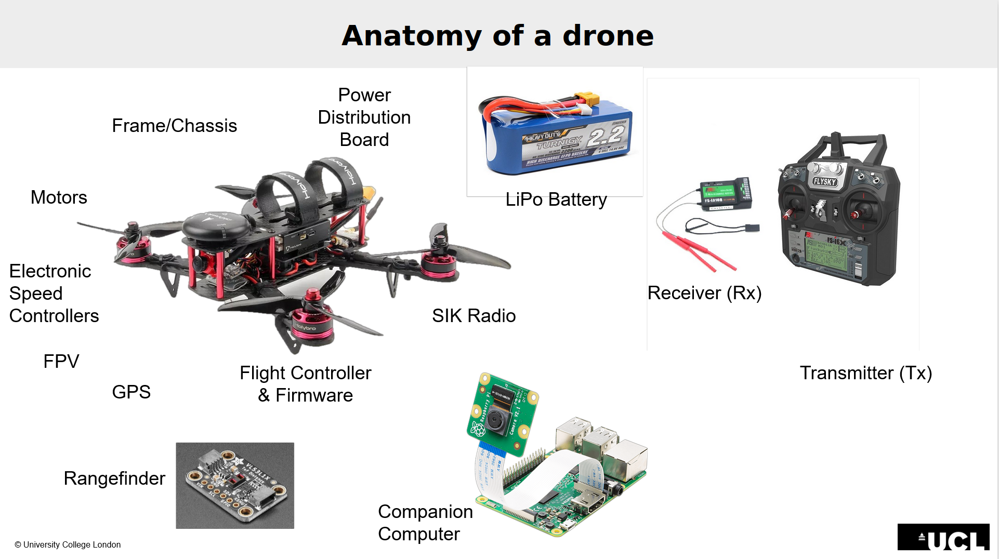

# Introduction to Drone Systems

This tutorial page gives you a brief overview of a drone system and the physical and software components that make up a drone system 

[TOC]

## What is a UAV or a Drone

A drone or unmanned aerial vehicle (UAV) is an unmanned "robotic" vehicle that can be remotely or autonomously controlled.

Drones are used for many consumer, industrial, government and military applications (opens new window). These include (non exhaustively): aerial photography/video, carrying cargo, racing, search and surveying etc.

> Different types of drones exist for use in air, ground, sea, and underwater. These are (more formally) referred to as Unmanned Aerial Vehicles (UAV), Unmanned Aerial Systems (UAS), Unmanned Ground Vehicles (UGV), Unmanned Surface Vehicles (USV), Unmanned Underwater Vehicles (UUV).

The "brain" of the drone is called an *autopilot*. It consists of flight stack software running on vehicle controller ("flight controller") hardware.

A *multi-rotor* is a specific type of UAV which uses two of more lift-generating rotors to fly. One of the most common will be the Quadrotor which has 4 motors in an 'X' pattern. These UAVs provide much simpler flight control than other types of aerial vehicle. This tutorial focuses on the flight of a simple quadrotor, but Starling can be used to operate many different types of robot.

> From this point on in this tutorial, 'drone' or 'UAV' will refer to a multi-rotor UAV unless otherwise stated.

## Types of Drones

These drones are used for many purposes, most notably in photography and education. Another type are fixed-wing drones, which resemble miniature airplanes and excel in long-range missions and mapping tasks. A third type are hybrid drones which combine the features of multirotor and fixed-wing drones, offering more versatility and extended flight time. Each drone type has its advantages and is suited to specific applications and operational requirements.

## Piloting Drones

Piloting drones takes a bit of practice, but it’s accessible enough that even kids can do it! The controller or joystick helps you to navigate your drone where you want it to go. Once airborne, there are four basic movements of drone flight that need to be mastered:

   - Throttle – vertical movement (up and down), sometimes called altitude. 
   - Yaw – rotation from left to right
   - Pitch – backward and forward movement
   - Roll – left to right movement without rotation

Once you get used to the terminology and the orientation of the drone, the sky is the literal limit!

Note that in more complicated systems such as the one we use today there are other modes to! The Yaw, Pitch, Roll above describes the attitude of the vehicle. Acrobatic and FPV drones usually operate on attitude rates, where the controller gives Pitch rates or yaw rates. This is desirable as it gives the feeling of immediate reaction to controls - although that does mean you have to actively stabilise the drone yourself. 

On the other side, even higher level control metods exist which translte attitude to cartesian x,y,z frames. Often drones end up being either velocity controlled or position controlled. The benefits of these higher level control is that you can command them to go to places relative to other things. The only downside is that the drone needs to know where it is in relation to the world - either using GPS, indoor positioning or onboard SLAM (simultaneous localisation and mapping) solutions. 

## Parts of a drone

